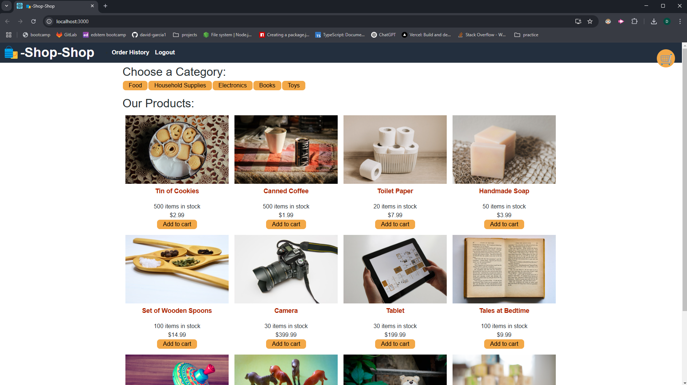

# ReduxStore

## Description
An e-commerce web application where users can create an account, log in, browse items, add them to a cart, make purchases, and log out. The application ensures secure authentication using JWT and efficiently manages state with Redux.

## Features
- User authentication (Sign Up, Login, Logout) using JWT
- Browse and search for products
- Add products to the shopping cart
- Checkout and payment processing (dummy implementation)
- User order history
- Secure and scalable backend with GraphQL
- State management with Redux

## Technologies Used
- **Frontend:** React, Redux, Redux Toolkit
- **Backend:** Node.js, Express, GraphQL (Apollo Server)
- **Database:** MongoDB (Mongoose ORM)
- **Authentication:** JSON Web Tokens (JWT)

---

# Screenshot
